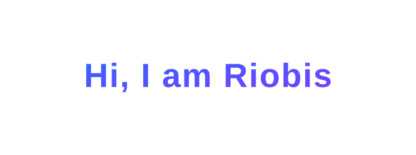

  

 Desenvolvedor <strong>Full Stack</strong> focado na construção de aplicações web modernas, performáticas e escaláveis.   Trabalho principalmente com <strong>TypeScript, React, Next.js e Node.js</strong>, desenvolvendo desde interfaces até APIs e sistemas completos. 

 Tenho experiência com <strong>APIs REST, autenticação JWT, PostgreSQL, MongoDB, Prisma, Docker, WebSocket e testes automatizados</strong>, sempre buscando manter o código organizado, sustentável e bem estruturado. 

## Skills

 

            

##

    

