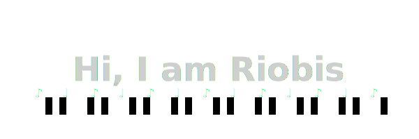

  

		
  	</a>
	

		Opa, eu sou desenvolvedor Front-End, desenvolvo em <strong>JavaScript, TypeScript, React, HTML e CSS.</strong> Estou aprendendo Back-End no momento
  

## skills
  
 
    
    
    
    
    

  
##

  
 
    
     
    
     

